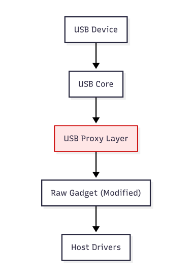

# Software Architecture

## Overview

The kernel-level USB proxy transparently mediates communication between a USB host system and a connected USB device. The implementation operates entirely inside the Linux kernel and combines descriptor-based policy enforcement with packet-level USB traffic inspection.

The architecture was designed to preserve the native behavior of supported USB devices while enabling security analysis and policy enforcement before and during device operation.

---

## Architecture Diagram



*Figure 1. High-level architecture of the kernel-level USB proxy.*

---

## System Overview

The proxy consists of four main software components:

- USB Proxy Control
- USB Policy Engine
- USB Packet Inspector
- Modified USB Raw Gadget

Together, these modules provide transparent USB forwarding while enabling descriptor analysis and packet inspection entirely inside the Linux kernel.

---

## USB Proxy Control

The USB Proxy Control module implements the main logic of the USB proxy.

Its responsibilities include:

- initialization of the proxy;
- communication with the modified USB Raw Gadget;
- management of USB request forwarding;
- coordination of the remaining proxy modules.

---

## USB Policy Engine

The USB Policy Engine performs descriptor-based security checks before device enumeration.

Its main responsibilities include:

- parsing USB descriptors;
- evaluating USB interface combinations;
- applying descriptor-based filtering rules;
- accepting or rejecting USB devices according to the configured policies.

Both default and dynamically configurable policies are supported through the Linux sysfs interface.

---

## USB Packet Inspector

The USB Packet Inspector performs runtime inspection of USB packets exchanged between the host system and connected USB devices.

Depending on the configured security policy, packets may be:

- forwarded unchanged;
- blocked;
- rejected before reaching the destination device.

This mechanism enables protection against suspicious USB commands transmitted either by malicious USB devices or by potentially compromised host systems.

---

## Modified USB Raw Gadget

The USB proxy is built upon a modified version of the Linux USB Raw Gadget implementation.

The original userspace-oriented design was extended with an internal kernel API that allows direct interaction with the USB proxy modules without relying on userspace communication.

The modified implementation is located in:

```
third_party/raw-gadget/
```

---

## Processing Workflow

The processing of a newly connected USB device follows the sequence below.

1. A USB device is connected.
2. The modified USB Raw Gadget receives USB requests from the host.
3. USB descriptors are analyzed by the USB Policy Engine.
4. If the device satisfies the configured policies, enumeration is allowed.
5. During normal operation, USB packets are inspected by the USB Packet Inspector.
6. USB traffic is forwarded to the destination unless a policy violation is detected.

---

## Design Objectives

The implementation was designed with the following objectives:

- transparent USB communication;
- descriptor inspection before enumeration;
- packet-level USB traffic inspection;
- configurable security policies;
- compatibility with multiple USB device classes;
- kernel-only implementation.

---

## Additional Information

Detailed build instructions are available in:

- `BUILD.md`

Experimental procedures and the validation methodology are described in:

- `EXPERIMENTS.md`

Further implementation details are available in the accompanying IEEE Access manuscript.